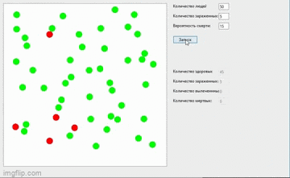

# Epidemic
The simulation model which shows the result of the epidemic
 

 
green - healthy
 
red - infected
 
blue - recovered
 
black - dead
 
The blue balls infest the green balls. After a while, the infected either recover or die (depending on the percentage).
